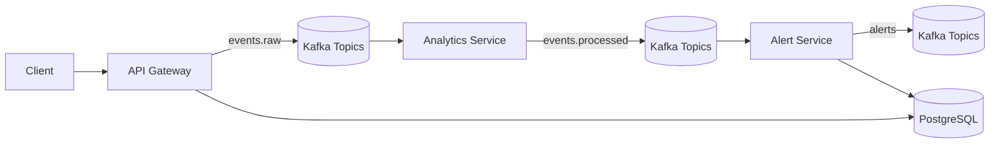
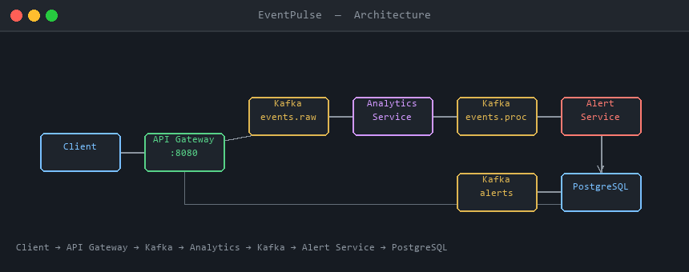
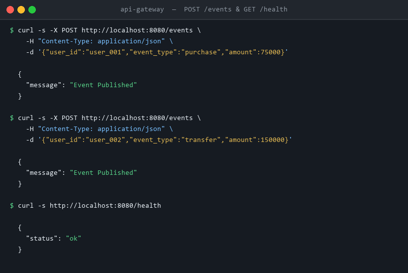
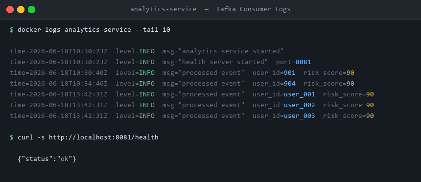
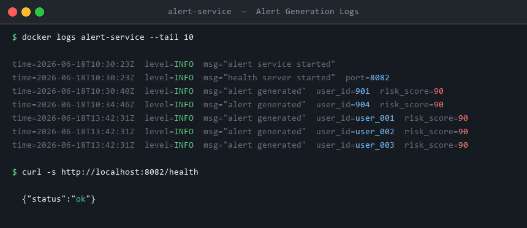
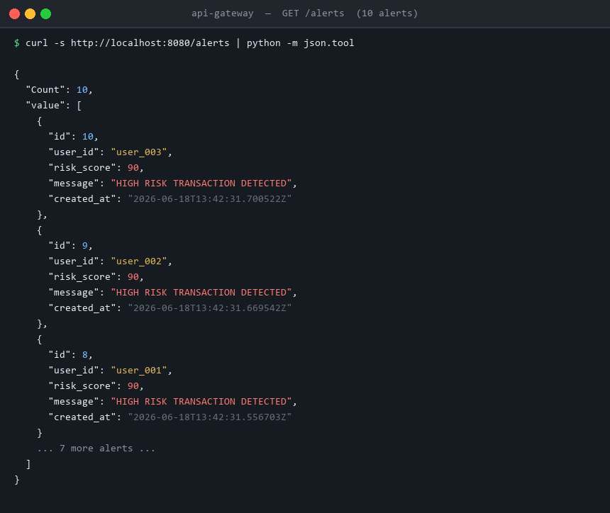

# EventPulse


EventPulse is a Dockerized, event-driven microservices platform built with Go, Apache Kafka, PostgreSQL, and Docker Compose. It showcases real-time fraud detection, distributed systems design, and a Kafka-based streaming pipeline. Transaction events are ingested in real time, scored by a streaming analytics service, converted into fraud alerts, and stored for retrieval through REST APIs.

## Project Overview

The system accepts transaction events over HTTP, scores them in a streaming analytics worker, generates alerts for high-risk activity, and stores those alerts in PostgreSQL.

## Tech Stack

### Backend

- Go (Golang)
- REST APIs
- Microservices

### Messaging & Event Streaming

- Apache Kafka
- Kafka Consumer Groups
- Event-Driven Architecture

### Database

- PostgreSQL

### Infrastructure & DevOps

- Docker
- Docker Compose
- Multi-Stage Docker Builds

### Tools

- Git
- GitHub

## Project Structure

```text
eventpulse/
├── services/
│   ├── api-gateway/
│   ├── analytics-service/
│   └── alert-service/
├── internal/
│   ├── config/
│   └── logger/
├── db/
│   └── init.sql
├── docs/
│   └── screenshots/
├── docker-compose.yml
└── README.md
```

## Resume Highlights

- Built a distributed event-driven microservices platform using Go and Kafka.
- Implemented real-time fraud detection through asynchronous event processing.
- Designed Kafka producer-consumer pipelines with consumer groups and offset management.
- Containerized services using Docker and Docker Compose.
- Integrated PostgreSQL for persistent alert storage and retrieval.

## Key Features

- Real-time event ingestion through `POST /events`.
- Kafka messaging pipeline across raw and processed topics.
- Risk scoring engine that flags high-value transactions.
- Fraud alert generation for high-risk events.
- PostgreSQL persistence for alert history.
- Consumer groups for scalable event processing.
- Dockerized deployment with multi-stage builds.
- End-to-end streaming architecture from API to database.

## Concepts Demonstrated

- Microservices
- Event-Driven Architecture
- Distributed Systems
- Apache Kafka
- Consumer Groups
- Message Streaming
- REST APIs
- Docker
- PostgreSQL
- Fault Tolerance
- Service Communication

## Architecture



Architecture labels:

- API Gateway
- Kafka Topics
- Analytics Service
- Alert Service
- PostgreSQL

## Validation Results

### Architecture Diagram



### API Request

Successfully publishing an event through the API Gateway.



### Analytics Processing

Analytics service consuming events from Kafka and calculating risk scores.



### Alert Generation

Alert service consuming processed events and generating fraud alerts.



### Alert Retrieval

Alerts stored in PostgreSQL and retrieved through the REST API.



## Microservices

- `api-gateway`: exposes REST endpoints and publishes incoming events to Kafka.
- `analytics-service`: consumes raw events, calculates risk scores, and publishes processed events.
- `alert-service`: consumes processed events, generates alerts, publishes them to Kafka, and stores them in PostgreSQL.

## End-to-End Flow

`POST /events` -> `events.raw` -> Analytics Service -> `events.processed` -> Alert Service -> PostgreSQL -> `GET /alerts`

## Local Setup

1. Install Docker Desktop and Go 1.26 or later.
2. Run `go build ./...` to verify the repository compiles.
3. Run `docker compose up -d --build` to start Kafka, PostgreSQL, and the three services.
4. Check the health endpoints at `http://localhost:8080/health`, `http://localhost:8081/health`, and `http://localhost:8082/health`.

## Kafka Topics

- `events.raw`
- `events.processed`
- `alerts`

## Database Schema

```sql
CREATE TABLE alerts (
    id SERIAL PRIMARY KEY,
    user_id TEXT NOT NULL,
    risk_score INT NOT NULL,
    message TEXT NOT NULL,
    created_at TIMESTAMPTZ NOT NULL DEFAULT NOW()
);
```

## Configuration

The repository works from a clean clone with built-in defaults in `docker-compose.yml`. Copy `.env.example` to `.env` only if you want to override local values.

Key environment variables:

- `DATABASE_DSN`
- `KAFKA_BROKERS`
- `KAFKA_TOPIC_RAW`
- `KAFKA_TOPIC_PROCESSED`
- `KAFKA_TOPIC_ALERTS`
- `KAFKA_ANALYTICS_GROUP`
- `KAFKA_ALERT_GROUP`
- `API_PORT`
- `ANALYTICS_HEALTH_PORT`
- `ALERT_HEALTH_PORT`

## Run

```bash
docker compose up --build
```

## Docker Commands

```bash
docker compose up -d --build
docker compose ps
docker compose logs -f api-gateway analytics-service alert-service
docker compose down -v
```

## API Examples

Create an event:

```bash
curl -X POST http://localhost:8080/events \
  -H "Content-Type: application/json" \
  -d '{"user_id":"123","event_type":"purchase","amount":50000}'
```

List alerts:

```bash
curl http://localhost:8080/alerts
```

Get an alert by ID:

```bash
curl "http://localhost:8080/alert?id=1"
```

## Health Checks

- API Gateway: `http://localhost:8080/health`
- Analytics Service: `http://localhost:8081/health`
- Alert Service: `http://localhost:8082/health`

## Troubleshooting

- If Kafka is still starting, wait for the healthcheck to pass before sending events.
- If PostgreSQL starts empty, confirm `db/init.sql` exists and that the volume was not reused from an older schema.
- If `POST /events` returns `kafka unavailable`, inspect `docker compose logs kafka api-gateway analytics-service alert-service`.
- If `/alerts` is empty, publish a high-risk event with `amount > 10000` and recheck the alert-service logs.

## Why This Project Matters

- Demonstrates distributed systems concepts such as async event flow, service boundaries, and consumer groups.
- Shows event-driven processing with Kafka as the backbone of communication.
- Highlights asynchronous communication between independent services.
- Uses Docker orchestration to keep the system reproducible locally.
- Strong backend engineering signal for interview discussions around reliability, scaling, and observability tradeoffs.

## Scalability Considerations

- Horizontal scaling using Kafka consumer groups.
- Independent service deployment.
- Loose coupling through event-driven communication.
- Cloud deployment readiness.
- Database scalability considerations.

## Repository Quality

- Clean-clone startup works without a pre-existing `.env` file.
- Dockerfiles use multi-stage builds.
- PostgreSQL schema is initialized during container startup.
- The current repo state has been validated end to end against the live stack.

## Production Notes

- Kafka consumers use explicit fetch and commit semantics.
- PostgreSQL schema is created during container initialization.
- Docker images use multi-stage builds.
- Logging is structured with service names and log levels.

## Related Docs

- [Project Status](PROJECT_STATUS.md)
- [Release Notes](RELEASE_NOTES.md)

## Future Enhancements

High-impact follow-ups:

1. Add a dead-letter topic for malformed Kafka messages.
2. Add Prometheus metrics and Grafana dashboards.
3. Add integration tests with Testcontainers.
4. Add idempotency keys for alert writes.
5. Add an outbox pattern for atomic Kafka and Postgres consistency.

## MIT License

This project is licensed under the MIT License. See [LICENSE](LICENSE) for details.
