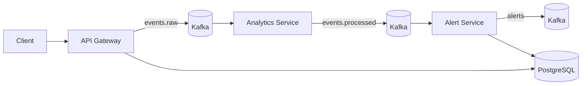

# EventPulse

EventPulse is a real-time fraud-detection pipeline built with Go, Apache Kafka, PostgreSQL, and Docker Compose.

## Project Overview

The system accepts transaction events over HTTP, scores them in a streaming analytics worker, generates alerts for high-risk activity, and stores those alerts in PostgreSQL.

## Architecture



  Architecture screenshot:

  - [Architecture SVG](docs/screenshots/architecture.svg)

  Validation screenshot:

  - [Validation SVG](docs/screenshots/validation.svg)

## Services

- `api-gateway`: exposes REST endpoints and publishes incoming events to Kafka.
- `analytics-service`: consumes raw events, calculates risk scores, and publishes processed events.
- `alert-service`: consumes processed events, generates alerts, publishes them to Kafka, and stores them in PostgreSQL.

## Local Setup

1. Install Docker Desktop and Go 1.26 or later.
2. Run `go build ./...` to verify the repository compiles.
3. Run `docker compose up -d --build` to start Kafka, PostgreSQL, and the three services.
4. Check the health endpoints at `http://localhost:8080/health`, `http://localhost:8081/health`, and `http://localhost:8082/health`.

## Kafka Topics

- `events.raw`
- `events.processed`
- `alerts`

## Database Schema

```sql
CREATE TABLE alerts (
    id SERIAL PRIMARY KEY,
    user_id TEXT NOT NULL,
    risk_score INT NOT NULL,
    message TEXT NOT NULL,
    created_at TIMESTAMPTZ NOT NULL DEFAULT NOW()
);
```

## Configuration

The repository works from a clean clone with built-in defaults in `docker-compose.yml`. Copy `.env.example` to `.env` only if you want to override local values.

Key environment variables:

- `DATABASE_DSN`
- `KAFKA_BROKERS`
- `KAFKA_TOPIC_RAW`
- `KAFKA_TOPIC_PROCESSED`
- `KAFKA_TOPIC_ALERTS`
- `KAFKA_ANALYTICS_GROUP`
- `KAFKA_ALERT_GROUP`
- `API_PORT`
- `ANALYTICS_HEALTH_PORT`
- `ALERT_HEALTH_PORT`

## Run

```bash
docker compose up --build
```

## Docker Commands

```bash
docker compose up -d --build
docker compose ps
docker compose logs -f api-gateway analytics-service alert-service
docker compose down -v
```

## API Examples

Create an event:

```bash
curl -X POST http://localhost:8080/events \
  -H "Content-Type: application/json" \
  -d '{"user_id":"123","event_type":"purchase","amount":50000}'
```

List alerts:

```bash
curl http://localhost:8080/alerts
```

Get an alert by ID:

```bash
curl "http://localhost:8080/alert?id=1"
```

## Health Checks

- API Gateway: `http://localhost:8080/health`
- Analytics Service: `http://localhost:8081/health`
- Alert Service: `http://localhost:8082/health`

## Troubleshooting

- If Kafka is still starting, wait for the healthcheck to pass before sending events.
- If PostgreSQL starts empty, confirm `db/init.sql` exists and that the volume was not reused from an older schema.
- If `POST /events` returns `kafka unavailable`, inspect `docker compose logs kafka api-gateway analytics-service alert-service`.
- If `/alerts` is empty, publish a high-risk event with `amount > 10000` and recheck the alert-service logs.

## Repository Quality

- Clean-clone startup works without a pre-existing `.env` file.
- Dockerfiles use multi-stage builds.
- PostgreSQL schema is initialized during container startup.
- The current repo state has been validated end to end against the live stack.

## Production Notes

- Kafka consumers use explicit fetch and commit semantics.
- PostgreSQL schema is created during container initialization.
- Docker images use multi-stage builds.
- Logging is structured with service names and log levels.

## Portfolio Improvements

High-impact follow-ups:

1. Add a dead-letter topic for malformed Kafka messages.
2. Add Prometheus metrics and Grafana dashboards.
3. Add integration tests with Testcontainers.
4. Add idempotency keys for alert writes.
5. Add an outbox pattern for atomic Kafka and Postgres consistency.